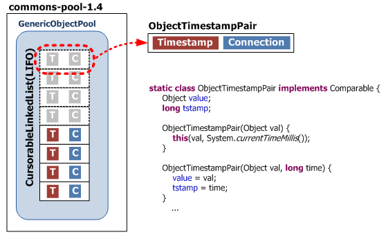

## DB Connection Pool

### 1. 커넥션 풀
 - DB와 연결된 커넥션을 미리 만들어서 pool 속에 저장해 두고 있다가 필요할 때 쓰고 반환하는 기법.
 - 웹 에서는 따로 XML이나 속성 파일로 관리하고, 이에 저장된 이름을 사용하여 획득한다.

### 2. 커넥션 풀 사용 이유
 - 한 명의 사용자가 데이터 취득, 갱신, 등록 등의 작업을 할 때 커넥션을 이용하게 된다.
 - 여러명의 사용자의 경우 커넥션이 많이 필요해 지므로 이러한 커넥션을 풀로 관리한다.

### 3. 커넥션의 개수
 - 저장 구조

     커넥션의 개수를 제대로 설정하려면 Commons DBCP 내부에서 커넥션 풀이 어떤 구조로 저장되는지 이해해야 함.
     커넥션 생성은 Commons DBCP에서 이루어짐
     Commons DBCP는, PoolableConnection 타입의 커넥션 생성 -> 커넥션에 ConnectionEventListener 등록
     해당 Listener에는 애플리케이션이 사용한 커넥션을 풀로 반환하기 위해, JDBC 드라이버가 호출할 수 있는 콜백 메서드가 있다.
     commons-pool은 타임스탬프와 추가된 커넥션의 레퍼런스를 한 쌍으로 하는 자료구조를 생성, LIFO 형태로 관리

 - 개수 관련 속성
   + InitialSize : 최초로 커넥션 풀에 채워 넣을 커넥션 개수 (getConnection())
   + maxActive : 동시에 사용할 수 있는 최대 커넥션 개수
   + maxIdle : 커넥션 풀에 반납할 때 최대로 유지될 수 있는 커넥션 개수
